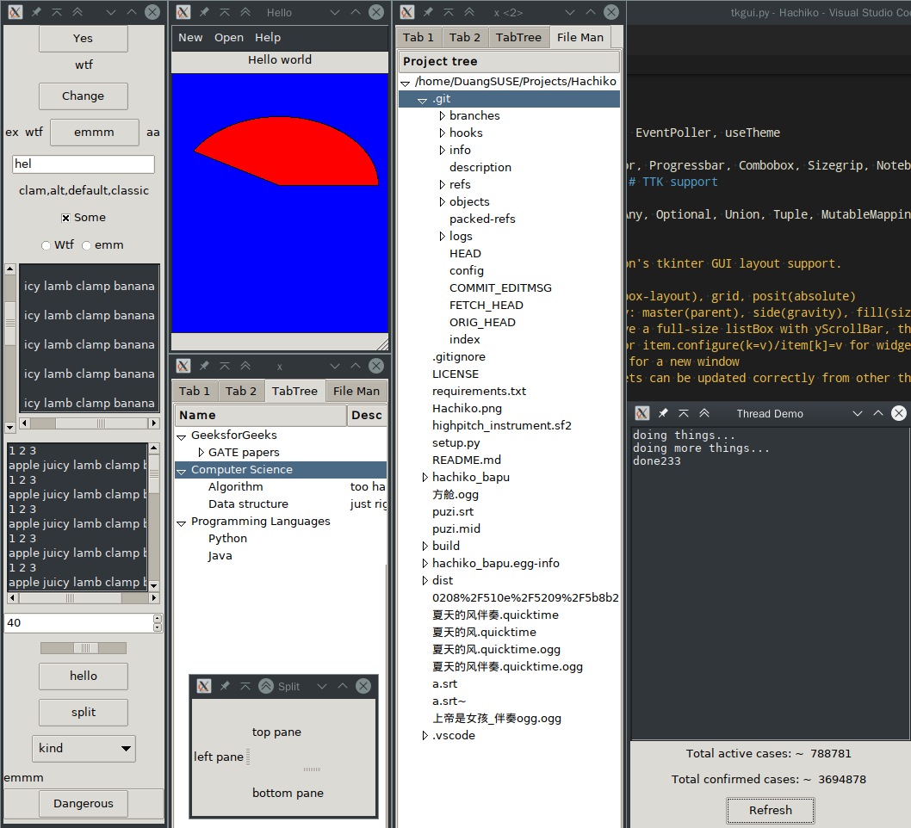
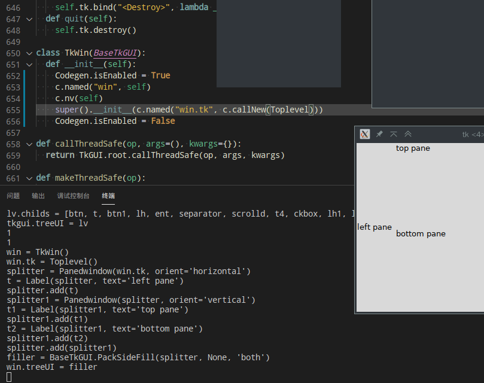

# TkGUI [](https://pypi.org/project/tkgui/)

Declarative tkinter wrapper for Python, features quick prototype and (dynamic type, "implicit") codegen.

## TkGUI is not quite Pythonic

I'm sorry about the missing documents, and the namespace `tkgui.tkgui` seems (I'm Not a good Pythoneer) :P

This library is just provided as-is, any pull requests are welcome. :smile:

(You should consider this project as my hobby personal research project, and never use it seriously in productions :\ )



>NOTE: examples are taken from [GeeksForGeeks](https://www.geeksforgeeks.org/python-tkinter-tutorial/) and [Tutorialspoint](https://www.tutorialspoint.com/python/tk_text.htm)

## Codegen ordering bug

> This issue was fixed in `0.1.1`



TkGUI's `Codegen` object is currently designed to generate code with post-order tree walk,
and it supposes all values are created with a construct expression that won't act like `Toplevel(root)` (it will create a new window besides returining a value)

And when `TkWin` is used, `Codegen` will produce output with both `TkWin`(which will call `Toplevel` once) and `Toplevel(root)` called, and that will results blank windows (too bad! even more annoying than crash direcly)

Currently, I have no idea about this, `Codegen` uses value-name substraction method
(it has fields `_constNames`+`_names`+`_exprs`+`_autoNamed`, methods `_allocName`, `named(name,obj)->T`, `newName(name,obj)->str`, `nv(obj)`"name a value", `_nvUnwrap`, `_addResult(res,expr_code)` )

But, if you don't use this feature(`getCode(run=False)` / `runCode(code)`), TkGUI works just fine.

## Other bad things about codegen

+ `_.var` created in `__init__` cannot have its initializer inclueded in result, so maybe I should add codegen listener runs when not `isEnabled`?

## Running Example with Codegen

```bash
[DuangSUSE@duangsuse]~/Projects/TkGUI% python ./example.py -
```

```python
def layout(self):
  _ = self.underscore
  c.setAttr(self, "a", _.var(str, "some"))
  c.setAttr(self, "b", _.var(bool))
  c.setAttr(self, "c", _.var(int))
  def addChild(): self.ui.appendChild(_.text("hhh"))
  return _.verticalLayout(
    _.button("Yes", self.quit),
    _.text(self.a),
    _.button("Change", self.up),
    _.horizontalLayout(_.text("ex"), _.text("wtf"), _.button("emmm",addChild), _.text("aa")),
    _.input("hel"),
    _.separator(),
    _.withScroll(_.vert, _.by("ta", _.textarea("wtf"))),
    _.by("ah", _.text("ah")),
    _.checkBox("Some", self.b),
    _.horizontalLayout(_.radioButton("Wtf", self.c, 1, self.pr), _.radioButton("emm", self.c, 2, self.pr)),
    _.horizontalLayout(
      _.by("sbar", _.scrollBar(_.vert)),
      _.verticalLayout(
        _.by("lbox", _.listBox(("1 2 3  apple juicy lamb clamp banana  "*20).split("  "))),
        _.by("hsbar", _.scrollBar(_.hor))
      )
    ),
    _.withScroll(_.both, _.by("box", _.listBox(("1 2 3  apple juicy lamb clamp banana  "*20).split("  ")))),
    _.comboBox(self.a, "hello cruel world".split(" ")),
    _.spinBox(range(0, 100+1, 10)),
    _.slider(range(0, 100+1, 2), orient=_.hor),
    _.button("hello", self.run1),
    _.button("split", self.run2),
    _.menuButton("kind", _.menu(MenuItem.CheckBox("wtf", self.b), MenuItem.RadioButton("emm", self.c, 9)), relief=_.raised),
    _.labeledBox("emmm", _.button("Dangerous", self.run3))
  )

```

^ Source v Results

```python
var = StringVar(root)
var.set('some')
tkgui.a = var
var1 = BooleanVar(root)
tkgui.b = var1
var2 = IntVar(root)
tkgui.c = var2
lv = BaseTkGUI.VBox(root)
lh = BaseTkGUI.HBox(lv)
t1 = Label(lh, text='ex')
t2 = Label(lh, text='wtf')
btn2 = Button(lh, text='emmm')
t3 = Label(lh, text='aa')
lh.childs = [t1, t2, btn2, t3]
ent = Entry(lv)
ent.delete(0, 'end')
ent.insert(0, 'hel')
scrolld = BaseTkGUI.ScrollableFrame(lv, 'vertical')
textarea = Textarea(scrolld)
textarea.insert('insert', 'wtf')
tkgui.ta = textarea
scrolld.item = textarea
t4 = Label(lv, text='ah')
tkgui.ah = t4
lh1 = BaseTkGUI.HBox(lv)
radioButton = Radiobutton(lh1, text='Wtf', variable=var2, value=1, command=GUI.pr)
radioButton1 = Radiobutton(lh1, text='emm', variable=var2, value=2, command=GUI.pr)
lh1.childs = [radioButton, radioButton1]
lh2 = BaseTkGUI.HBox(lv)
scrollBar = Scrollbar(lh2, orient='vertical')
sbar = BaseTkGUI.PackSideFill(scrollBar, None, 'y')
tkgui.sbar = sbar
lv1 = BaseTkGUI.VBox(lh2)
lbox = Listbox(lv1, selectmode='browse')
lbox.insert(0, '1 2 3')
lbox.insert(1, 'apple juicy lamb clamp banana')
lbox.insert(2, '1 2 3') # omitted
lbox.insert(39, 'apple juicy lamb clamp banana')
lbox.insert(40, '')
tkgui.lbox = lbox
scrollBar1 = Scrollbar(lv1, orient='horizontal')
sbar1 = BaseTkGUI.PackSideFill(scrollBar1, None, 'x')
tkgui.hsbar = sbar1
lv1.childs = [lbox, sbar1]
lh2.childs = [sbar, lv1]
scrolld1 = BaseTkGUI.ScrollableFrame(lv, 'both')
lbox1 = Listbox(scrolld1, selectmode='browse')
lbox1.insert(0, '1 2 3')
lbox1.insert(1, 'apple juicy lamb clamp banana')
lbox1.insert(2, '1 2 3') # omitted
lbox1.insert(39, 'apple juicy lamb clamp banana')
lbox1.insert(40, '')
tkgui.box = lbox1
scrolld1.item = lbox1
menuButton = Menubutton(lv, text='kind')
menu = Menu(menuButton, tearoff=False)
menu.add_checkbutton(label='wtf', variable=var1)
menu.add_radiobutton(label='emm', variable=var2, value=9)
menuButton['menu'] = menu
labeledBox = Labelframe(lv, text='emmm')
btn5 = Button(labeledBox, text='Dangerous', command=GUI.run3)
btn5.pack()
btn = Button(lv, text='Yes', command=TkGUI.quit)
t = Label(lv, textvariable=var)
btn1 = Button(lv, text='Change', command=GUI.up)
separator = Separator(lv, orient='horizontal')
ckbox = Checkbutton(lv, text='Some', variable=var1, onvalue=True, offvalue=False, command=nop)
cbox = Combobox(lv, textvariable=var, values=['hello', 'cruel', 'world'])
spinBox = Spinbox(lv, values=(0, 10, 20, 30, 40, 50, 60, 70, 80, 90, 100))
slider = Scale(lv, from_=0, to=100, orient='horizontal')
btn3 = Button(lv, text='hello', command=GUI.run1)
btn4 = Button(lv, text='split', command=GUI.run2)
lbox2 = BaseTkGUI.PackSideFill(labeledBox, None, 'both')
lv.childs = [btn, t, btn1, lh, ent, separator, scrolld, t4, ckbox, lh1, lh2, scrolld1, cbox, spinBox, slider, btn3, btn4, menuButton, lbox2]
tkgui.treeUI = lv
```

It's really long... But actually, only minimal code is generated. (I can't imagine how long will it takes writing this by hand)

## Details About Codegen

view at [tkgui_utils.py](tkgui/tkgui_utils.py#L87)

```python
  def call(self, op, *args, **kwargs): pass
  def callNew(self, ctor, *args, **kwargs): pass
  def invoke(self, x, op_name, *args, **kwargs): pass
  def setAttr(self, x, name, v): pass
  def setItem(self, x, key, v): pass

  def defaultName(self, callee, x):
    return fmt.defaultNameMap.get(callee) or callee
  def _name(self, args, kwargs):
    #process args/ init local var
    for (key, x) in kwargs.items():
      if callable(x):
        qname = fmt.opRef(x)
        if qname != None: namKwargs[key] = qname
      else: namKwargs[key] = self.nv(x)
    return (namArgs, namKwargs)

  def nv(self, x):
    def nameRef():
      # let = pipe non-none or none
      return kst or let(fmt.nameRef, nam) or self._nvUnwrap(x) or fmt.value(x)
    expr = self._exprs.get(x)
    if expr == None:
      expr = fmt.autoExpr(x)
      if expr != None: self._autoNamed.add(x) # process autoExpr +autoname
    if expr != None and expr != "+":
      name = self._names.get(x)
      if name == None and (x in self._autoNamed):
        name = self.newName("%s_1" %type(x).__name__.lower(), x) # autoname
      if name != None: self.write(lambda: fmt.assign(name, expr) )
      self._exprs[x] = "+" # assign code only for 1st time
    return nameRef()

  def _regResult(self, res, get_code):
    if not Codegen.isEnabled: return
    if res == None: self.write(get_code); return # python's default func result
    code = get_code()
    self._exprs[res] = code
    self._autoNamed.add(res)

  def _allocName(self, name):
    qname = name #key point.
    while qname in self._names.values(): qname = Codegen.nextName(qname)
    return qname
  def named(self, name, x, is_extern=False):
    self._names[x] = self._allocName(name)
    if is_extern: self._constNames[x] = name
    return x
```

Anybody can help? :sob:
